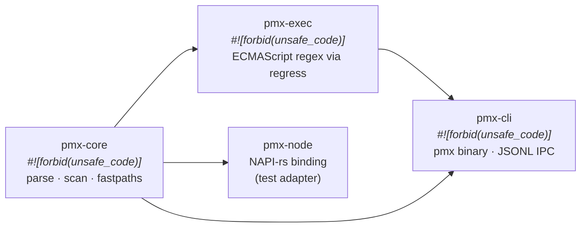

<h1 align="center">picomatch-rs</h1>

<p align="center">
  <a href="https://github.com/gauravk16in/picomatch/actions/workflows/ci.yml"></a>
  <a href="https://www.rust-lang.org"></a>
  <a href="LICENSE"></a>
  <a href="https://github.com/micromatch/picomatch"></a>
  <a href="crates/pmx-core/src/lib.rs"></a>
</p>

<p align="center">
  <strong>A blazing fast, production-grade, pure-Rust port of <a href="https://github.com/micromatch/picomatch"><code>picomatch</code></a> v4.0.5.</strong><br>
  <em>100% bug-for-bug behavioral parity · zero unsafe code · 10,000+ differential oracle tests</em>
</p>

---

## Why picomatch-rs?

JavaScript's `picomatch` is the industry-standard glob matcher powering **Jest, Rollup, Chokidar, Storybook, Astro, Snowpack, Netlify, AWS Amplify**, and over 5 million open-source projects.

Porting it to Rust presents unique challenges:

- **JavaScript string semantics** — JS strings are UTF-16 code unit sequences. V8 regex escaping can produce ill-formed surrogate halves that crash Rust `String` or corrupt index offsets.
- **Fastpath vs. slow-path divergence** — `picomatch` maintains two deliberately byte-divergent code routes for the same patterns. Both must be ported as-is.
- **Complex parser recovery** — Unclosed braces/brackets trigger backtracking and `escapeLast` recovery loops that alter state before emission.

`pmx` solves all of these with **1977/1977 test parity** (100.00%), verified by differential testing against the original JavaScript implementation.

---

## Architecture



| Crate | Responsibility | Safety |
|---|---|---|
| [**pmx-core**](crates/pmx-core) | Core compiler (`parse`), scanner (`scan`), fastpath engine, options | `#![forbid(unsafe_code)]` |
| [**pmx-exec**](crates/pmx-exec) | Execute emitted ECMAScript regex sources via `regress` | `#![forbid(unsafe_code)]` |
| [**pmx-cli**](crates/pmx-cli) | `pmx` binary with `--serve` JSONL IPC transport | `#![forbid(unsafe_code)]` |
| [**pmx-node**](crates/pmx-node) | NAPI-rs binding for Node.js test adapters | Macro-generated NAPI code only |

---

## Quick Start

> **Note:** `pmx` is not yet published to crates.io. Use path dependencies for now.

```toml
[dependencies]
pmx-core = { path = "crates/pmx-core" }
pmx-exec = { path = "crates/pmx-exec" }
```

```rust
use pmx_core::{parse, Options};
use pmx_exec::{is_match, ExecFlags};

fn main() -> Result<(), Box<dyn std::error::Error>> {
    let opts = Options::default().with_dot(true);

    // 1. Compile glob pattern to regex source
    let state = parse("src/**/*.rs", &opts)?;

    // 2. Encode target path as UTF-16 code units
    let target: Vec<u16> = "src/parse/main_loop.rs".encode_utf16().collect();

    // 3. Execute match
    let matched = is_match(&state.output, &target, ExecFlags::default())?;
    assert!(matched);

    Ok(())
}
```

---

## Features

| Feature | Syntax | Example |
|---|---|---|
| **Wildcards** | `*`, `?` | `*.rs` matches `main.rs` |
| **Globstars** | `**` | `src/**/*.rs` matches nested paths |
| **Braces** | `{a,b}`, `{1..10}` | `{src,lib}/*.rs` expands alternation |
| **Extglobs** | `@()`, `+()`, `*()`, `?()`, `!()` | `!(test).rs` matches anything except `test.rs` |
| **POSIX classes** | `[[:alnum:]]`, `[[:digit:]]` | 14 standard classes supported |
| **Negation** | `!pattern` | `!*.log` excludes log files |
| **Windows paths** | `opts.with_windows(true)` | Treats `\` as path separator |
| **Dot matching** | `opts.with_dot(true)` | Matches `.hidden` files |

For full API reference, options table, and struct definitions, see [**docs/api.md**](docs/api.md).

---

## Verification

### Rust-only (no Node.js required)

```bash
# Prerequisites: Rust 1.97.1+ (auto-installed via rust-toolchain.toml)

# Verify format + lint + all Rust tests
make verify

# Or run gates individually:
cargo fmt --check
cargo clippy --workspace --all-targets -- -D warnings
cargo test --workspace
```

### Differential Parity Testing (requires Node.js 22+ and picomatch v4.0.5)

```bash
# Step 1: point PICOMATCH_REF at a local v4.0.5 checkout
git clone --branch 4.0.5 --depth 1 https://github.com/micromatch/picomatch.git ../Main
export PICOMATCH_REF="$(cd ../Main && pwd)"

# Step 2: run differential gates
node fixtures/run-integrated.js      # 16-step integrated harness
node fixtures/attack-scan.js         # Adversarial scanner attacks
node fixtures/attack-integrated.js   # Adversarial parser attacks

# Step 3: run benchmark canaries (build scanbench first)
cargo build --release --example scanbench
node benchmarks/bench-canaries.js    # 79 mutation-tested canaries
```

See [docs/judging-evidence.md](docs/judging-evidence.md) for PR timeline, SHA hashes, and full correctness evidence.

---

## Benchmarks

Scanner benchmark (20 process pairs, 10,000 bootstrap resamples, seed=42):

| Result | Count | Examples |
|---|---|---|
| **Rust faster** (CI excludes 1.0) | 13 scenarios | `nonegate` 1.92×, `noext-globstar` 1.72×, `noparen` 1.69× |
| **JS faster** (CI excludes 1.0) | 5 scenarios | Plain paths, deep globstars |
| **Inconclusive** (CI overlaps 1.0) | 2 scenarios | |

> **No universal speedup is claimed.** Results are mixed and scenario-dependent.
> See [docs/benchmarks.md](docs/benchmarks.md) for full methodology and per-scenario tables.

---

## Upstream Bugs Discovered

While maintaining 100% test parity, our audit identified two correctness bugs in picomatch v4.0.5:

1. **BUG-001 — Unclosed brace recovery emits invalid regex.** Recovery searches for `{` but the parser emits `(` — `escapeLast` finds nothing. Additionally, backtrack rebuilds wipe recovery fixes.
2. **BUG-002 — `opts.prepend` discarded for `./` patterns.** The `./` prefix collapse clears `state.output`, destroying prepended text.

Full analysis with reproduction steps: [docs/upstream-bugs.md](docs/upstream-bugs.md).

---

## Documentation

| Document | Description |
|---|---|
| [**docs/api.md**](docs/api.md) | Full API reference, options table, state struct definitions |
| [**docs/benchmarks.md**](docs/benchmarks.md) | Benchmark methodology, per-scenario results, environment details |
| [**docs/decisions.md**](docs/decisions.md) | Architecture and parity decisions (D-01 through D-18) |
| [**docs/upstream-bugs.md**](docs/upstream-bugs.md) | Bugs discovered in picomatch v4.0.5 |
| [**docs/judging-evidence.md**](docs/judging-evidence.md) | PR timeline, SHA hashes, correctness evidence |
| [**docs/design/**](docs/design/) | Per-chunk design documents (C0–C9), parse state machine |

---

## Project Structure

```
pmx/
├── crates/
│   ├── pmx-core/         # Core compiler (6,200+ lines)
│   ├── pmx-exec/         # Regex execution engine
│   ├── pmx-cli/          # CLI binary
│   └── pmx-node/         # NAPI-rs binding
├── docs/                  # Design, decisions, benchmarks, audits
├── fixtures/              # Oracle corpora + differential harnesses
├── benchmarks/            # Benchmark runner + results
├── fuzz/                  # cargo-fuzz differential fuzzer
├── tests/original/        # Byte-frozen copy of upstream JS test suite
├── adapter/               # Node.js compatibility shims (for test parity)
├── Makefile               # make check | test | verify | bench
└── CONTRIBUTING.md        # How to contribute
```

---

## Contributing

See [CONTRIBUTING.md](CONTRIBUTING.md) for prerequisites, workflow, and code conventions.

## License & Credits

This project is licensed under the [MIT License](LICENSE).

`pmx` is a Rust port of [`micromatch/picomatch`](https://github.com/micromatch/picomatch), originally written by [Jon Schlinkert](https://github.com/jonschlinkert) and contributors.
